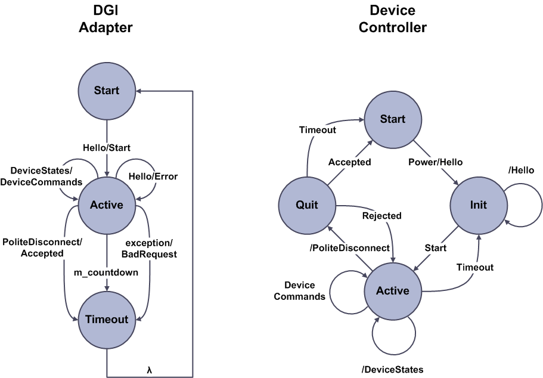

.. _pnp-adapter:

Plug and Play Adapter
=====================

The PNP Adapter allows the DGI to communicate with plug and play devices. Unlike the other adapter types, PNP adapters are created automatically and do not need to be specified in an adapter configuration file. However, by default, the plug and play behavior of the DGI is disabled.

Communication Protocol
----------------------

The plug and play protocol uses TCP/IP with the DGI listening for client connections from physical devices on a configurable port number. All packets in the protocol are written in ASCII and converted to floating point numbers within the DGI. An overview of both sides of the protocol is shown in the following state machine.

The protocol begins with both the DGI and the device controller in their respective start states. For the DGI, this state corresponds to some time after the DGI has created its TCP/IP socket that listens for connections from devices. For the device, the start state represents when the device is powered off or disconnected. First, the device powers on and its controller sends the DGI a Hello message. The contents of this message tell the DGI which devices are connected to the controller, and the DGI uses the Hello message to construct a new plug and play adapter. If the new adapter is created without error, the DGI responds with a Start message and maintains the client socket for the duration of the protocol. A separate socket will be maintained for each concurrent plug and play connection to the DGI.

Once the plug and play adapter has been created, the DGI will remain in its active state until the device powers off, loses communication with the DGI, or causes an exception during the protocol. While in this state, the DGI expects the device to send it periodic DeviceStates messages which the it will respond to with a corresponding DeviceCommands message. Unlike the RTDS adapter protocol, the DGI expects the device to send it the states before it issues commands. The plug and play connection is maintained by the DGI as long as it receives periodic DeviceStates messages from the device.

A device can gracefully disconnect from the DGI by sending a PoliteDisconnect message. However, if a device fails to send a DeviceStates message for a configurable timeout period, the DGI will close the socket connection and delete the plug and player adapter under the assumption the device has crashed or gone offline. As shown in the state machine, the DGI does not notify the device when it choses to terminate the connection. If a device comes back online after the connection has been terminated, it must restart the protocol from the Hello message.

Messages from the Device
^^^^^^^^^^^^^^^^^^^^^^^^

Hello Message::

    Hello\r\n
    UniqueID\r\n
    DeviceType1 DeviceName1\r\n
    DeviceType2 DeviceName2\r\n
    ...
    DeviceTypeN DeviceNameN\r\n
    \r\n

The hello message tells the DGI the number and type of devices that are associated with the device controller. Each device controller must have a unique name stored in non-volatile memory that it reuses each time it connects to the DGI. This name replaces the ``UniqueID`` placeholder string in the message format, and tells the DGI which controller has initiated the connection. It is imperative that this identifier be the same every time the same controller connects to the DGI to prevent the DGI from creating multiple plug and play adapters for a single device controller. In addition, the ``DeviceType#`` fields must be replaced with the unique identifiers for devices registered in the *device.xml* file. The unique identifier corresponds to the **<id>** tag as discussed in the virtual device tutorial, :ref:`configure-device-xml`.

DeviceStates Message::

    DeviceStates\r\n
    DeviceName1 State1 Value\r\n
    DeviceName1 State2 Value\r\n
    ...
    DeviceNameN StateM Value\r\n
    \r\n

The device state message gives the current values for all states of the devices listed in the hello message. If a device from the hello packet has a state, then its device name must appear in this message. In addition, this message cannot contain partial device states. If a device has three states listed in the *device.xml* configuration file, then all three states for that device must be included in this message. When the device states message is received. the DGI will convert each of the value fields into a floating point number. If a device from the hello packet is missing, or at least one state is missing, or at least one value is not numeric, then DGI will reject the message. The device controller can use the special null value of 10^8 if it cannot give the DGI a state to indicate the value should be ignored.

PoliteDisconnect Message::

    PoliteDisconnect\r\n
    \r\n

This message indicates that a device is about to turn off and wishes to terminate the connection. The device controller should wait for a response from the DGI before closing its TCP socket.

Error Message::

    Error\r\n
    Message\r\n
    \r\n

Both the DGI and device controller can send this message, and it indicates that some error has happened during execution of the protocol. This error might not be fatal, and often the DGI sends it to indicate that a received packet did not have the expected format and was dropped.

Messages from the DGI
^^^^^^^^^^^^^^^^^^^^^

Start Message::

    Start\r\n
    \r\n

The start message indicates that the DGI has created a plug and play adapter for the device controller and the main protocol can begin. Once this message has been sent, the DGI expects to receive periodic DeviceStates messages from the device or it will terminate the TCP connection without warning. The device controller should start sending DeviceStates as soon as the Start message is received.

DeviceCommands Message::

    DeviceCommands\r\n
    DeviceName1 Command1 Value\r\n
    DeviceName1 Command2 Value\r\n
    ...
    DeviceNameN CommandM    Value\r\n
    \r\n

The device command packet is sent by the DGI in response to a state packet. All commands for all devices are included in this packet, even if the DGI does not have a command to issue or the command has not changed since the last packet. If the DGI does not have a command for a device, then the value for that command will be set to the special null value of 10^8 to indicate the value should be ignored. The value for the device name field will be identical to the names provided by the controller in the hello message, and the value for the command fields will be pulled from the *device.xml* configuration file.

PoliteDisconnectAccepted Message::

    PoliteDisconnect\r\n
    Accepted\r\n
    \r\n

This message acknowledges a polite disconnect request from a device controller and indicates that the DGI will terminate the TCP connection to the device as soon as the message is delivered.

PoliteDisconnectRejected Message::

    PoliteDisconnect\r\n
    Rejected\r\n
    \r\n

This message tells the device controller that the DGI has received a disconnect request, but it cannot yet terminate the TCP connection. In the current version of the DGI, this message is never sent as all disconnect requests are accepted.

Error Message::

    Error\r\n
    Message\r\n
    \r\n

Both the DGI and device controller can send this message, and it indicates that some error has happened during execution of the protocol. This error might not be fatal, and often the DGI sends it to indicate that a received packet did not have the expected format and was dropped.

Configuration
-------------

The plug and play protocol must be enabled through the main DGI configuration file ``Broker/config/freedm.cfg``. If a port number is provided for the TCP server that listens for device connections, then the plug and play protocol will be initialized after running DGI. Otherwise, the plug and play protocol will be disabled. The port number can be set using the command ``factory-port=X`` anywhere on its own line in the *freedm.cfg* file. Once this port number has been specified, the plug and play protocol has been enabled. All hello messages sent from device controllers should be sent to this port to initiate the plug and play protocol.

Sample Device Controller
------------------------

A sample implementation of the device controller side of the plug and play protocol is available on the `FREEDM-DGI git repository <https://github.com/FREEDM-DGI/device-controller>`_. This sample implementation requires both a configuration file that tells the controller how to communicate with the DGI, as well as a script that controls the behavior of the device controller over time. As the controller is not connected to real physical hardware, its behavior changes only in response to this script.

A sample configuration file can be found at ``config/samples/controller.cfg``. The important configurable options in this file are the name, host, and port entries. The name specifies the unique identifier for the device controller that will be included in the hello packet, and must be unique if multiple controllers are used at the same time. The host and port fields must be set to the location of the DGI plug and play server, which will be the hostname of the linux machine that runs the DGI and the port number specified for the factory-port option in the DGI configuration file. The remaining fields do not need to be changed from their default values.

A sample script file can be found at ``config/samples/dsp-script.txt``. A script must be provided for the controller in order for it to function after connecting to the DGI. Without a script, the controller will send a PoliteDisconnect packet to the DGI as soon as it receives the Start message from the DGI. Each script contains a sequence of commands follower by a special work command. After all of the commands in the script are processed, the controller will disconnect from the DGI.

Available Script Commands
^^^^^^^^^^^^^^^^^^^^^^^^^

::

    enable DeviceType DeviceName State1 InitialValue1 ... StateN InitialValueN

The enable command adds a new device to the controller which will be included in the next Hello message. Each state of the device must be specified and given an initial value, but a value can be set to 10^8 to force the DGI to ignore it. After this command is used in the script, the controller will disconnect from the DGI and restart the protocol with a fresh hello message.

::

    disable DeviceName

The disable command deletes a device that was added using a prior enable command. This command also causes the controller to disconnect from the DGI and restart the protocol using a fresh hello message.

::

    change DeviceName State NewValue

The change command updates the value of a device state. DeviceName must have been added using a prior enable command, and the state must refer to one of the states that was initialized when the enable command was used. Like all device states, the value must be a floating point number or it will be rejected by the DGI. This command will change the values sent in the device states message.

::

    dieHorribly Duration

The dieHorribly command causes the controller to be unresponsive to the DGI for a given amount of time (stop sending state messages). This can be used to simulate network traffic or slow processing speed, but does not simulate connection failure as controller socket is still maintained for the duration of the command.

::

    work Duration

The work command causes the protocol to continue in its active state for the specified duration. During this time, the controller will send the DGI device state messages and receive command messages. However, the internal state of the device will not change for the duration of the work command.

::

    work forever

Often the last command in a script, this will cause the controller to stay in the active state until the process is terminated by the user. No commands after this command will be read from the script, and the controller can never change its internal state once this command has been processed.
