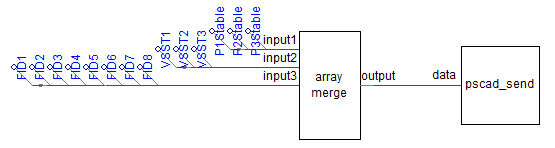
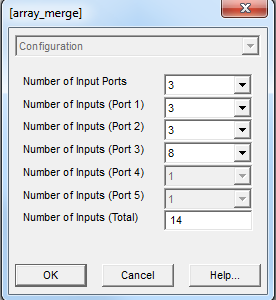
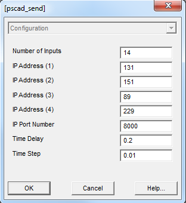
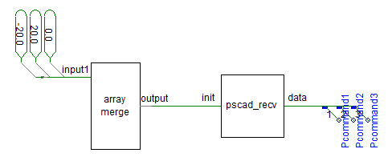
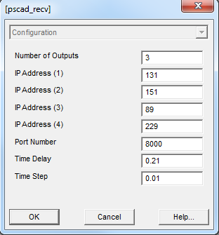

.. _pscad-simulation:

Running a PSCAD Simulation
==========================

When running a PSCAD simulation, three separate processes are required:

1. The PSCAD simulation running on a windows machine.
2. A simulation server connected to PSCAD running on a linux machine.
3. The DGI configured with an RTDS adapter and connected to the simulation server.

This tutorial will describe how to setup both PSCAD and the simulation server. Details on configuration of the DGI can be found in the section :ref:`rtds-adapter`.

Required Files
--------------

The code required to run both PSCAD and the simulation server is stored in a repository separate from the rest of the DGI. This repository can be found `on github <https://github.com/FREEDM-DGI/pscad-interface>`_ and must be checked out or downloaded in order to proceed with this tutorial. In addition, it may be helpful to download an existing simulation from `this list <https://github.com/FREEDM-DGI/FREEDM/downloads>`_ of files as a reference.

PSCAD Simulation
----------------

The files related to the PSCAD simulation are found in the ``pscad`` directory of the repository. The ``.cmp`` files are new components that must be imported into the PSCAD simulation. A component can be imported into PSCAD by right-clicking the Definitions tab in the project workspace and selecting the import definitions option. An instance of each component should also be added to the simulation by right-clicking on its definition, clicking create instance, and then pasting the instance inside the simulation schematic. For this tutorial, one instance of both *pscad_send* and *pscad_recv* is sufficient, but you will need two instances of the *array_merge* component.

These components contain Fortran scripts that require the code found in ``psocket.c``. This C file should be placed in the same directory as your simulation ``.psc`` file. Both the scripts and C file were designed to work with the free GFortran compiler provided with PSCAD, and alternative compilers are unlikely to work. Specifically, it is unlikely that a compiler that does not translate the Fortran scripts into C during the compilation process will work.

.. warning:: PSCAD must be set to use the GFortran compiler or it will not be able to call the C code.

Sending Data using PSCAD_SEND
^^^^^^^^^^^^^^^^^^^^^^^^^^^^^

Create an instance of both the *pscad_send* and *array_merge* components and connect them as shown in the following diagram:

All of the data that will be sent out of PSCAD into the DGI has been assigned a signal name. These signals have been merged together using the default PSCAD ``data merge`` component found in the master library. Multiple data merge components had to be used to handle all of the data because each handles at most 12 inputs due to the limitations of PSCAD. These separate components were then combined into a single array through use of the ``array merge`` component that was imported from the git repository. The final output of the array merge component, which is a single large array that contains all the data that will be sent out from PSCAD, is used as an input for the ``pscad send`` component.

The first step to connecting the components as shown in the example is to configure the array merge component to have the correct number of input pins for the amount of data that will be sent to DGI. Determine how many signals will be sent from PSCAD, and then access the properties of the ``array merge`` component:

The structure of the array merge component is that it supports up to 5 input pins, and each input pin receives the output of a single data merge component. As such, the maximum amount of data that can be sent from PSCAD is 60. The first property, the number of input ports, should be set to the number of data merge components that are required for your data set. In the example, this value is three, and there are a total of three input pins (input1, input2, input3) available for use. If this property is changed, the number of pins on the component will also change when the properties window is saved and closed.

Each input port must then be configured to know the size of the data merge component connected to it. This is done through the next five number of input (port #) properties. For each one of these properties, the value should be set to the number of data points be merged on the associated input pin. For example, the number of inputs for port 3 in the example is set to 8 because there are a total of 8 signals put through the data merge component on the input3 port. 

The final number of inputs total property will be the total number of signals put through the array merge component, or the sum of the preceeding five properties.

The *pscad_send* component must also be configured:

The number of inputs property should be set to the same value as that given for the *array_merge* component, and should be the total amount of data points being sent out of PSCAD.

Each of the IP address fields refers to the IPv4 address of the simulation server associated with PSCAD. All simulations must have an associated linux machine running the simulation server code from the git repository. That server will store the current simulation state for the DGI to easily access. The IP and port fields from the *pscad_send* component should be set for the linux machine that will run the server. In the example, PSCAD will attempt to connect to the server located at 131.151.89.229:8000 during runtime.

The time delay property is used to delay the sending of data until after the simulation reaches its steady state. It should be set to the simulation time at which data should first be sent to the DGI. The time step property then refers to the frequency at which data is sent after this delay. At each multiple of the time step value, PSCAD will send the input signals to the simulation server.

.. note:: PSCAD will not send data to the simulation unless the simulation time is greater than the time delay specified in the pscad_send component.

Receiving Data with PSCAD_RECV
^^^^^^^^^^^^^^^^^^^^^^^^^^^^^^

Create an instance of both the *pscad_recv* and *array_merge* components and connect them as shown:

All the data that will be received by PSCAD must be assigned an initial value. When the simulation begins, there is a configurable delay before PSCAD receives the first set of values from the simulation server. There will always be at least one simulation step where PSCAD has yet to receive these values from the server. In this case, the initial values defined in PSCAD will be used until the first bit of data from the simulation server arrives. These initial values are the inputs that go through the array merge component into *pscad_send*.

The output of *pscad_recv* is a large array that contains all of the data sent to PSCAD. Each element of the array must be individually accessed using the ``data tap`` component from the default PSCAD master library. Data tap components must be individually modified to access separate elements of the output array.

The properties of the array merge component are discussed in the previous section on sending data and will be skipped. For the *pscad_recv* properties:

The first property defines the number of elements in the output array, and should be set to the number of data points that will be received from the simulation server.

The next set of properties defines the IPv4 address of the simulation server in the same manner as the *pscad_send* component. Although this component is set to receive data, due to the nature of PSCAD it is impossible to maintain a stable socket over multiple simulation steps, and so the receive component connects as a client to the server and requests the next set of simulation commands. As such, the server endpoint must be specified even when receiving data. In the example, the *pscad_recv* component is configured to retrieve data from the simulation server located at 131.151.89.229:8000.

both the time delay and time step are the same as with the *pscad_send* component. The time delay prevents PSCAD from receiving data until after a certain simulation time, while the time step specifies how many simulation seconds are between two successive data reads. However, the time delay for the receive component should be set to a larger value than the one assigned to the send component to ensure that PSCAD always sends at least one value to the simulation server before it tries to read a command.

.. note:: Prior to the specified time delay, the output of the pscad_recv component is equal to the initial values provided as an input.

Simulation Server
-----------------

The simulation server must run a compiled version of the code from the repository downloaded earlier. The repository can be compiled using the sequences of commands `cmake .` and `make` from the main repository directory. This will produce the simulation server executable which by default has the filename ``driver``. To configure the simulation server, move all files from ``config/samples/`` into ``config/`` and then open ``config/rtds.xml`` to change its settings to match your simulation. The rest of this section will describe how to modify this XML file, as the other two configuration files will work with their default values.

The XML configuration file has a strict format illustrated in the following example::

  <root>
      <adapter type="TYPE" port="PORT">
          <state>
              <entry index="INDEX">
                  <device>DEVICE</device>
                  <signal>SIGNAL</signal>
                  <value>VALUE</value>
              </entry>
          </state>
          <command>
              <entry index="INDEX">
                  <device>DEVICE</device>
                  <signal>SIGNAL</signal>
                  <value>VALUE</value>
              </entry>
          </command>
      </adapter>
  </root>

There is a main **<root>** tag that contains the complete configuration of the server. Under this, there will be one **<adapter>** tag for each client (simulation and DGI instances) connected to the server. Each **<adapter>** must be specified under **<root>** and assigned both a type and a port number. The port number must be unique and defines which port number that client will connect to when communicating with the simulation server. For instance, if the PSCAD simulation has been configured to connect to port 8000 as in the example, then the adapter with ``port=8000`` define the configuration for talking with PSCAD. The type must be either *simulation* or *rtds* and refers to the adapter type the simulation server uses to communicate with the client. *Simulation* refers to the PSCAD simulation, while *RTDS* refers to an instance of the DGI (which uses its RTDS adapter to communicate with PSCAD).

There is no hard limit on the number of adapters that can be specified. There is also no limit on how many instances of a specific adapter type can be specified. It is possible, for example, to create twelve different simulation adapters that communicate with twelve concurrent PSCAD power simulations. The variables from all simulations will be stored together in the simulation server and be accessible to all of the DGI.

Each adapter also follows a strict format::

    <state>
        <entry index="INDEX">
            <device>DEVICE</device>
            <signal>SIGNAL</signal>
            <value>VALUE</value>
        </entry>
    </state>
    <command>
        <entry index="INDEX">
            <device>DEVICE</device>
            <signal>SIGNAL</signal>
            <value>VALUE</value>
        </entry>
    </command>

The **<state>** tag refers to a value that originates from PSCAD, while the **<command>** tag refers to a value that originates from some DGI instance. It is not possible to omit either tag, and neither tag can be empty. This means that you cannot run a simulation where PSCAD receives no commands, or one of the DGI instances does not receive a state. All clients connected to the simulation server must both send and receive data.

.. note:: If you run a simulation where one client does not send or receive data, it should send a fake dummy value that will not be used by the other end.

Each entry for a state or command has the same format::

    <entry index="INDEX">
        <device>DEVICE</device>
        <signal>SIGNAL</signal>
        <value>VALUE</value>
    </entry>

The index refers to the index of the data if it were sent as a byte stream of data. Even if the adapter does not send and receive byte streams, a valid index must be specified. The index must begin with 1 and contain unique, consecutive integers.

The "device" and "signal" tags are both required and generate a unique identifier for an entry in the device table. If two entries are in the same table (state or command) and have the same "device" and "signal" pair, even if they are in different adapters, they refer to the same memory location.

The "value" tag is optional and specifies an initial value for the "device" and "signal" pair. This value will be set in the device table when memory is allocated for the device signal. If the same device signal is specified in multiple entries, the value only needs to be specified once. It does not matter where the value is specified. A value can also be specified multiple times without error, so long as all of the tags contain the same numeric value. If a device signal does not have an initial value, the tag can be omitted.

Note that a device signal must be specified in each adapter that uses it. This means there will be a large number of duplicate "device" "signal" pairs in the specification. Spend time when writing the device specification file to make sure all of these duplicate entries have the same spelling, as otherwise the device table will have an inconsistent state.

Running the Simulation
----------------------

#. Start the simulation server with the command ./driver.
#. Run each instance of the DGI that connects to the simserv
#. Run the PSCAD simulation with the green arrow on the top toolbar.
#. Select Yes if the simulation warns that it will use a large amount of memory.
#. Allow the firewall exception if windows complains about the processes' internet usage

.. note:: You will need administrative access on the windows machine running PSCAD to allow the firewall exception for PSCAD.

A turning gear icon will appear in the lower-right corner to indicate the simulation is running. After some time, the current simulation time will appear in this corner below the gear icon. If the simulation time never appears, and the message log does not indicate a compilation error, then the simulation has been misconfigured and cannot connect to the simulation server. If the time advances, the connection has been formed.

Common Errors
-------------

User Source File does not exist
^^^^^^^^^^^^^^^^^^^^^^^^^^^^^^^

psocket.c is not in the same directory as simulation.psc - verify the files have been kept together, or obtain a new version of psocket.c from the repository.

psocket.c:7:19: error: netdb.h: No such file or directory
^^^^^^^^^^^^^^^^^^^^^^^^^^^^^^^^^^^^^^^^^^^^^^^^^^^^^^^^^

netdb.h is not in the GFortran/version/include folder. You must obtain a version of this file and place it in this folder.

psocket.c:8:24: error: sys/socket.h: No such file or directory
^^^^^^^^^^^^^^^^^^^^^^^^^^^^^^^^^^^^^^^^^^^^^^^^^^^^^^^^^^^^^^

socket.h is not in the GFortran/version/include/src folder. You must obtain a version of this file and place it in this folder.

The simulation stalls or stops responding
^^^^^^^^^^^^^^^^^^^^^^^^^^^^^^^^^^^^^^^^^

The TCP Sockets are set to block until a connection is made to the Interface. If the simulation stalls, either the Interface code is not running or the pscad_send and pscad_recv components have not been configured to use the correct Interface IPv4 address. Run the Interface, or correct the IP Address and Port Number fields.

