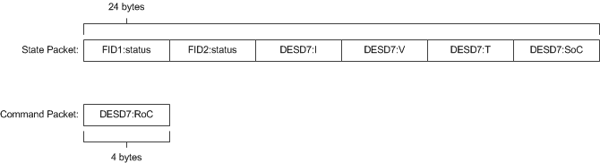
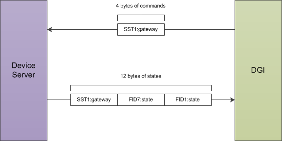

.. _rtds-adapter:

RTDS Adapter
============

All communication between the DGI and physical devices is done through a set of classes called adapters. An adapter defines a communication protocol that the DGI uses to connect to real devices. The DGI can contain multiple adapters, and each adapter can use a different communication protocol. This allows, for instance, the DGI to talk to both a power simulation and real physical hardware at the same time. The DGI comes with multiple adapter types that can be used to interface with physical devices (either real or simulated). Configuration of the DGI depends on the type of adapter that is used. For almost all cases, we recommend use of the RTDS adapter. Despite its name, this adapter works with both RTDS and PSCAD, and has also been used to communicate with real hardware. Unless the user has extensive knowledge on the DGI, the RTDS adapter should be the default choice. The following sections document the two adapter types provided by the DGI team (RTDS and Plug and Play), as well as how to create a new adapter should neither option be viable.

The RTDS adapter was designed to allow the DGI to communicate with the FPGA connected to the RTDS rack at Florida State University. However, it has also become the default choice for connecting the DGI to a PSCAD simulation, and is a viable option when interfacing the DGI with real physical hardware. This is the adapter type recommended by the DGI development team. Throughout this section, the term device server will be used to refer to the endpoint the DGI communicates with while using the RTDS adapter. When using an RTDS simulation, the device server would be the FPGA server connected to the RTDS. When using PSCAD, the device server is a piece of code called the simulation server that runs on a linux computer. And when using real hardware, the device server refers to the controller attached to the physical device.

Configuration
-------------

The DGI can be configured to use one or more RTDS adapters through modification of the adapter specification file ``Broker/config/adapter.xml``. This file contains the specifications for all adapters in the systems, and as such can contain multiple adapter specifications. Each adapter specification is located under the common **<root>** tag under its own **<adapter>** subtag. The following tutorial will cover how to create a new RTDS adapter specification for an RTDS simulation with the following devices:

+-------------+--------------------------+----------------------------+
| Device Type | States (Readable Values) | Commands (Writable Values) |
+=============+==========================+============================+
| FID1        | status                   |                            |
+-------------+--------------------------+----------------------------+
| FID2        | status                   |                            |
+-------------+--------------------------+----------------------------+
| DESD7       | I (current),             | RoC (rate of charge)       |
|             | V (voltage),             |                            |
|             | T (temperature),         |                            |
|             | SoC (state of charge)    |                            |
+-------------+--------------------------+----------------------------+

An important note is that this specification does not contain DESD1 through DESD6, which are presumed to exist. Each DGI instance has its own adapter specification file, and each file should contain the devices associated with its associated DGI. In this example, we can assume that the specification file is for DGI #7 which has control over DESD #7. Therefore, there must be similar (but not identical) configuration files for the other 6 DGI instances. Unlike SCADA systems, the DGI is distributed and each DGI instance only has knowledge of a subset of the devices in the system.

The DGI can communicate with physical devices which have been defined in its device configuration file. For a tutorial on how to define new virtual devices within the DGI, refer to the tutorial :ref:`configure-device-xml`.

.. warning:: When running a power simulation, only a subset of the devices should be sent to each DGI!

The first step in our example is to create a new RTDS adapter that contains the devices in the simulation. Each adapter must have a type and a unique name, which must be specified within its associated **<adapter>** tag. For our example::

    <root>
        <adapter name = "ExampleAdapter" type = "rtds">
            <!-- (comment) the adapter will be defined here -->
        </adapter>
    </root>

The ``name`` and ``type`` properties for the **<adapter>** tag are not optional. In addition, the name must be unique (if there are multiple adapters running at once) and the type must be rtds (since we are defining an RTDS adapter). In the current version of the DGI, the name field is not used by RTDS adapters and can be set to any arbitrary, but unique, value. 

Now the RTDS adapter has been defined, but the DGI has not been told the endpoint for the device server that contains the simulation data. Because the RTDS adapter communication protocol utilizes TCP/IP, the endpoint is specified using a hostname and port number. If the device server is located on the computer with hostname FPGA-Hostname listening for connections on port 52000, the endpoint can be specified using an **<info>** tag as follows::

    <root>
        <adapter name = "ExampleAdapter" type = "rtds">
            <info>
                <host>FPGA-Hostname</host>
                <port>52000</port>
            </info>
            <!-- (comment) this specification is still incomplete! -->
        </adapter>
    </root>

This enables the DGI to connect to the device server, but still does not tell the DGI the format of the state and command packets used during communication with the server. Both packet formats must be specified in the adapter configuration file. Specification of both packet formats is similar, but our tutorial will consider the state packet first.

The state packet format is defined under **<adapter>** using the **<state>** tag. Each state contained in this packet is defined as a separate **<entry>** subtag which contains all the information the DGI needs to parse the state packet. There are several require properties for each state entry:

#. The **index** of the state in the the packet. Indices range from 1 to the number of floating point values in the packet, and each index must be unique. If a state entry is given a value of i, then the DGI assumes that that state will be the i:sup:`th` floating point value in the state packet. Therefore, when the DGI needs to access the state, it will read the state packet starting from a byte offset of 4i.
#. The **signal** name for the state entry. For instance, a DESD device could have a current state which uses the signal identifier of I. This field tells the DGI that the state entry located at this index refers to a current value. All signal names must correspond to some **<state>** tag of a **<deviceType>** in the *device.xml* configuration file, see :ref:`configure-device-xml`.
#. The **type** of physical device that owns the signal. For instance, a current value could refer to either the current at a generator or the current at a battery. The type field makes it explicit as to which sort of device the current is associated with. This allows the DGI to create an appropriate type of virtual device to handle storage of the state entry. All type identifiers must correspond to some **<id>** tag of a **<deviceType>** in the *device.xml* configuration file.
#. The **device** name of the device that owns the signal. In our example, there are two FID devices and so there will be two state signals with the value *status* that belong to a device of type *FID*. This field disambiguates which of the two FID devices the state belongs to. In addition, the DGI can access individual devices through use of this device name. For this reason, the name must be unique within the adapter specification file.

For our example, the state configuration would be::

    <root>
        <adapter name = "ExampleAdapter" type = "rtds">
            <info>
                <host>FPGA-Hostname</host>
                <port>52000</port>
            </info>
            <state>
                <entry index = 1>               <!-- The index must appear together with the entry tag -->
                    <type>Fid</type>            <!-- This defines the device type (from device.xml) -->
                    <device>FID1</device>       <!-- This is the unique name / identifier -->
                    <signal>status</signal>     <!-- This defines the state type (from device.xml) -->
                </entry>
                <entry index = 2>
                    <type>Fid</type>
                    <device>FID2</device>
                    <signal>status</signal>
                </entry>
                <entry index = 3>
                    <type>Desd</type>
                    <device>DESD7</device>
                    <signal>I</signal>
                </entry>
                <entry index = 4>
                    <type>Desd</type>
                    <device>DESD7</device>
                    <signal>V</signal>
                </entry>
                <entry index = 5>
                    <type>Desd</type>
                    <device>DESD7</device>
                    <signal>T</signal>
                </entry>
                <entry index = 6>
                    <type>Desd</type>
                    <device>DESD7</device>
                    <signal>SoC</signal>
                </entry>
            </state>
            <!-- (comment) this specification is still incomplete! -->
        </adapter>
    </root>

A similar specification must be done for the format of the command packet using the tag **<command>**. All of the required properties of states are also required for commands, and the XML format for both is identical. As such, the commands in our example lead to the final configuration file format::

    <root>
        <adapter name = "ExampleAdapter" type = "rtds">
            <info>
                <host>FPGA-Hostname</host>
                <port>52000</port>
            </info>
            <state>
                <entry index = 1>
                    <type>Fid</type>
                    <device>FID1</device>
                    <signal>status</signal>
                </entry>
                <entry index = 2>
                    <type>Fid</type>
                    <device>FID2</device>
                    <signal>status</signal>
                </entry>
                <entry index = 3>
                    <type>Desd</type>
                    <device>DESD7</device>
                    <signal>I</signal>
                </entry>
                <entry index = 4>
                    <type>Desd</type>
                    <device>DESD7</device>
                    <signal>V</signal>
                </entry>
                <entry index = 5>
                    <type>Desd</type>
                    <device>DESD7</device>
                    <signal>T</signal>
                </entry>
                <entry index = 6>
                    <type>Desd</type>
                    <device>DESD7</device>
                    <signal>SoC</signal>
                </entry>
            </state>
            <command>
                <entry index = 1>               <!-- The index must appear together with the entry tag -->
                    <type>Desd</type>           <!-- This defines the device type (from device.xml) -->
                    <device>DESD7</device>      <!-- This is the unique name / identifier -->
                    <signal>RoC</signal>        <!-- This defines the command type (from device.xml) -->
                </entry>
            </command>
        </adapter>
    </root>

This completes the RTDS adapter specification for our example. With this specification file, the command packet will be 4-bytes and contain a single command that corresponds to the rate of chargre for DESD7. The state packet will be 24-bytes and contain 6 separate floating point numbers. The following figure shows the exact format of both packets.

Both the **<state>** and **<command>** tags are required, even if there are no states or commands associated with a given adapter. For example, if this adapter did not contain the DESD device and instead contained the two FID devices, the sample configuration file would change to resemble::

    <root>
        <adapter name = "ExampleAdapter" type = "rtds">
            <info>
                <host>FPGA-Hostname</host>
                <port>52000</port>
            </info>
            <state>
                <entry index = 1>
                    <type>Fid</type>
                    <device>FID1</device>
                    <signal>status</signal>
                </entry>
                <entry index = 2>
                    <type>Fid</type>
                    <device>FID2</device>
                    <signal>status</signal>
                </entry>
            </state>
            <command>
                <!-- The empty command tag must still be included -->
            </command>
        </adapter>
    </root>

If the contents of the state tag are omitted, the DGI will never attempt to read from the TCP/IP socket it uses to communicate with the device server. Likewise, if the command tag is omitted, the DGI will never write a command packet to the device server. In both of these cases the communication protocol becomes unidirectional. However, in both cases, the **<state>** and **<command>** tags themselves must still be included as in above.

Configuration Errors
^^^^^^^^^^^^^^^^^^^^

#. The name field for each adapter must be unique.
#. Each **<type>** specified during the state and command packet configuration must refer to the **<id>** of a **<deviceType>** found in the *device.xml* configuration file.
#. Each **<signal>** specified during the state or command packet configuration must refer to some **<state>** or **<command>** of its associated **<type>** in the *device.xml* configuration file.
#. When a device of a specific **<type>** is specified, all of its **<state>** and **<command>** values from the *device.xml* configuration file must appear in the adapter configuration file. It is impossible to use a subset of the states or commands of a device when using an RTDS adapter.
#. The complete state and command specification of each device must be contained within a single **<adapter>**. If a device spans multiple adapters, it will result in tremendously undefined behavior.
#. Indices for state and command entries must be unique, consecutive, and start counting from an initial index of 1.
#. All adapters must have a **<state>** and **<command>** subtag, even if the contents of the tags are empty.

Communication Protocol
----------------------

The RTDS adapter uses TCP/IP to connect to a server with access to some set of physical devices. When the DGI runs using an RTDS adapter, it attempts to create a client socket connection to an endpoint specified in the adapter configuration file during startup. Once connected, it sends a periodic command packet to the server, and expects to receive a device state packet in return. The device server must be running and prepared to receive connections before the DGI starts when using an RTDS adapter. In addition, the DGI will always send its command packet before the device server responds with its state packet.

This communication protocol is very brittle. If the DGI loses connection to the server, it will not attempt to reconnect and after some time the DGI process will terminate. In addition, if the DGI receives a malformed or unexpected packet from the server, it will terminate with an exception. Therefore, this protocol should only be used on a stable network.

The following diagram shows on round of message exchanges in the communication protocol. It assumes that there are three states produced by the devices, and one command produced by the DGI.

Both the command packet from the DGI and the state packet from the device server contain a stream of 4-byte floating point numbers. Other data formats such as boolean or string values cannot be used with the RTDS adapter; all the device states must be represented as floats. The command packet must contain every command for the devices attached to the server, while the state packet must contain every device state. It is not possible to send a subset of the commands, or to send the values for different commands at different times. If the DGI has not calculated the value of a particular command, it will send a special value of 10^8 to indicate a NULL command. The device server must recognize and ignore the value of 10^8 when parsing the command packet received from the DGI. Likewise, the device server can use the value of 10^8 for device states which are not yet available when communicating with the DGI.

Running the Device Server
-------------------------

The steps discussed so far configure the DGI to connect to a device server utilizing a particular packet format. However, the device server must also be configured to expect the same packet format as the DGI. Because the RTDS adapter can be used for multiple power simulations, the configuration of the device server depends on the type of simulation being run. The details for configuration are thus delegated to the individual tutorials on how to run specific simulations.

If you are simulating with PSCAD, see :ref:`pscad-simulation`.

If you are simulating with RTDS, see :ref:`rtds-simulation`.
