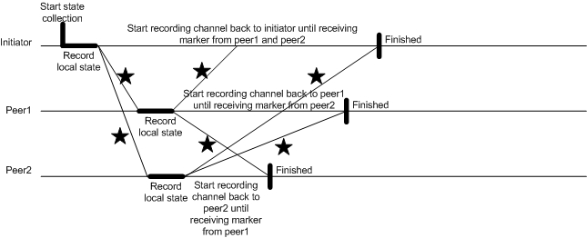

.. _state-collection:

State Collection
================

DGI state collection provides a method for collecting a casually consistent state of devices in a group of DGI.

Using State Collection
---------------------------

State collections are requested using the DGI message passing interface.
Modules submit requests to state collection, state collection runs those collections during it's phase, and returns the collected state a message to the requesting module.

Supported Signal Types
^^^^^^^^^^^^^^^^^^^^^^

The following signal and device types are supported. To support more signals, you'll need to modify the StateCollection code. See :ref:`sc-add-signals`

=========== ===================
Device Type Supported Signal(s)
=========== ===================
Sst         gateway
Drer        generation
Desd        storage
Load        drain
Fid         state
=========== ===================

Requesting State Collection
^^^^^^^^^^^^^^^^^^^^^^^^^^^

State collection requests are initiated with a ``sc::RequestMessage``.
The message must contain:

* `module` - The module that requests the state collection (in order to return the result to the requesting module. Set with **set_module()**
* One or more ``DeviceSignalRequestMessages`` which contain the device type and signal you wish to collect. Each ``DeviceSignalRequestMessages`` must have their `type` and `signal` values set. `type` is the type of device to collect the value from (For example, "Sst") and the specific signal from that device (For example, "gateway"). State collection will collect the values from the first device of that type attached to the DGI.

Example: Collecting Single Device/Value
"""""""""""""""""""""""""""""""""""""""

This example requests values from one device (**SST**) per DGI in the group::

    sc::StateCollectionMessage msg;
    sc::RequestMessage * submsg = msg.mutable_request_message();
    submsg->set_module("YOURMODULE");
    
    sc::DeviceSignalRequestMessage * subsubmsg = submsg->add_device_signal_request_message();
    subsubmsg->set_type("Sst");
    subsubmsg->set_signal("gateway");

    ModuleMessage m;
    m.mutable_state_collection_message()->CopyFrom(msg);
    m.set_recipient_module("sc");

The module prepares an ``sc::StateCollectionMessage`` then accesses its child ``request_message``, and adds the signals that need to be collected (In this case, SST's gateway values).
It then packs the message into a module message and addresses it to State Collection.

Example: Multiple Devices
"""""""""""""""""""""""""

This example requests values from multiple devices (**SST, DESD, DRER**) per DGI in the group::

    sc::StateCollectionMessage msg;
    sc::RequestMessage * state_request = msg.mutable_request_message();
    state_request->set_module("YOURMODULE");

    sc::DeviceSignalRequestMessage * device_state;
    device_state = state_request->add_device_signal_request_message();
    device_state->set_type("Sst");
    device_state->set_signal("gateway");

    device_state = state_request->add_device_signal_request_message();
    device_state->set_type("Desd");
    device_state->set_signal("storage");

    device_state = state_request->add_device_signal_request_message();
    device_state->set_type("Drer");
    device_state->set_signal("generation");

    ModuleMessage m;
    m.mutable_state_collection_message()->CopyFrom(msg);
    m.set_recipient_module("sc");
    
       
Collected State Response
^^^^^^^^^^^^^^^^^^^^^^^^

State collection will send back the following state response, which contains the collected state::

    message CollectedStateMessage
    {
        repeated double gateway = 1;
        repeated double generation = 2;
        repeated double storage = 3;
        repeated double drain = 4;
        repeated double state = 5;
        required int32 num_intransit_accepts = 6;
    }
    
Values can be accessed by iterating over the values in the ``sc::CollectedStateMessage`` fields.
Each of the fields in the above message can be accessed through a function call to that field's name.
For example, accessing the gateway values can be done with the gateway() method of the ``sc::CollectedStateMessage``.
    
Here is an example **HandleCollectedState** method::

    HandleCollectedState(const sc::CollectedStateMessage &m, const CPeerNode& peer)
    {
        ...
        //for SST device
        BOOST_FOREACH(float v, m.gateway())
        {
            //print out each gateway value from collected message
            Logger.Info << "Gateway value is " << v << std::endl;
        }

        //for DRER device
        BOOST_FOREACH(float v, m.generation())
        {
            //print out each generation value from collected message
            Logger.Info << "Generation value is " << v << std::endl;
        }

        //for DESD device
        BOOST_FOREACH(float v, m.storage())
        {
            //print out each storage value from collected message
            Logger.Info << "Storage value is " << v << std::endl;
        }
    }

.. _sc-add-signals:
    
Adding New Signal Types
^^^^^^^^^^^^^^^^^^^^^^^

To add a new signal or device to state collection, first add a new entry to the CollectedState message in ``src/messages/StateCollection.proto``. For example, to add a new frequency signal to a new or existing device one line related to signal type frequency should be added as follows::

    message CollectedStateMessage
    {
        repeated double gateway = 1;
        repeated double generation = 2;
        repeated double storage = 3;
        repeated double drain = 4;
        repeated double state = 5;
        repeated double frequency = 6; // New line for the new signal.
        required int32 num_intransit_accepts = 7;
    }

Make sure you adjust the assigned numbers for the fields accordingly.

Next, in the ``StateResponse()`` method of ``sc/StateCollection.cpp`` add the new device or signal. In this example, we have added both a new device (Omega) and a new signal to that device (frequency)::

    if (dssm.type() == "Sst")
    {
        if(dssm.count()>0)
        {
            csm->add_gateway(dssm.value());
        }
        else
        {
            csm->clear_gateway();
        }
    }
    else if (dssm.type() == "Drer")
    {
        if(dssm.count()>0)
        {
            csm->add_generation(dssm.value());
        }
        else
        {
            csm->clear_generation();
        }
    }
    else if (dssm.type() == "Desd")
    {
        if(dssm.count()>0)
        {
           csm->add_storage(dssm.value());
        }
        else
        {
           csm->clear_storage();
        }
    }
    else if (dssm.type() == "Omega")
    {
        if(dssm.count()>0)
        {
            csm->add_frequency(dssm.value());
        }
        else
        {
            csm->clear_frequency();
        }
    }

When LB requests the state of the OMEGA device with SST, DESD, DRER, requested message will need to add following code related with the OMEGA device in LoadBalance.cpp file::

    sc::StateCollectionMessage msg;
    sc::RequestMessage * state_request = msg.mutable_request_message();
    state_request->set_module("lb");

    sc::DeviceSignalRequestMessage * device_state;
    device_state = state_request->add_device_signal_request_message();
    device_state->set_type("Sst");
    device_state->set_signal("gateway");

    device_state = state_request->add_device_signal_request_message();
    device_state->set_type("Desd");
    device_state->set_signal("storage");

    device_state = state_request->add_device_signal_request_message();
    device_state->set_type("Drer");
    device_state->set_signal("generation");

    // New device and signal
    device_state = state_request->add_device_signal_request_message();
    device_state->set_type("Omega");
    device_state->set_signal("frequency");

When LB handles received states back in LoadBalance.cpp file, the following code related with OMEGA with signal type frequency should be added::

    HandleCollectedState(const sc::CollectedStateMessage &m)
    {
        ...
        //for SST device
        BOOST_FOREACH(float v, m.gateway())
        {
            //print out each gateway value from collected message
            Logger.Info << "Gateway value is " << v << std::endl;
        }

        //for DRER device
        BOOST_FOREACH(float v, m.generation())
        {
            //print out each generation value from collected message
            Logger.Info << "Generation value is " << v << std::endl;
        }

        //for DESD device
        BOOST_FOREACH(float v, m.storage())
        {
            //print out each storage value from collected message
            Logger.Info << "Storage value is " << v << std::endl;
        }

        // New device and signal
        //for OMEGA device
        BOOST_FOREACH(float v, m.frequency())
        {
            //print out each frequency value from collected message
            Logger.Info << "Frequency value is " << v << std::endl;
        }
    }

Implementation Details
----------------------

Theory: Algorithm in State Collection
^^^^^^^^^^^^^^^^^^^^^^^^^^^^^^^^^^^^^
The DGI State Collection module is implemented based on the Chandy-Lamport algorithm [1], which is used to collect consistent states of all participants in a distributed system. A consistent global state is one corresponding to a consistent cut. A consistent cut is left closed under the causal precedence relation. In another words, if one event is belongs to a cut, and all events happened before this event also belong to the cut, then the cut is considered to be consistent. The algorithm works as follows:

* The initiator starts state collection by recording its own states and broadcasting a marker out to other peers. At the same time, the initiator starts recording messages from other peers until it receives the marker back from other peers.
* Upon receiving the marker for the first time, the peer records its own state, forwards the marker to others (include the initiator) and starts recording messages from other peers until it receives the marker back from other peers.

The following diagram illustrates the Chandy-Lamport algorithm working on three nodes. The initiator is the leader node chosen by Group Management module in DGI. 

Message Passing
^^^^^^^^^^^^^^^

State collection defines the following message types

* **MarkerMessage**
* **DeviceSingalStateMessage**
* **StateMessage**
* **DeviceSingalRequestMessage**
* **RequestMessage**
* **CollectedStateMessage** 
* **StateCollectionMessage**

SCAgent Reference
^^^^^^^^^^^^^^^^^^^^^^^^^^

State Collection Functions

* HandleIncomingMessage: "Downcasts" incoming messages into a specific message type, and passes the message to an appropriate handler.
* HandleRequest: Handle RequestMessage from other modules. Extract type and value of devices and insert into a list with certain format.
* Initiate: Initiator records its local state and broadcasts marker to the peer node.
* TakeSnapshot: Record its local states according to the device list.
* HandleMarker: Handle MarkerMessage.
* SaveForward: Save its local state and send marker out.
* SendStateBack: Send its collected state back to the initiator.
* HandleState: Handle StateMessage return back from the peer node.
* StateResponse: Handle collected states and prepare CollectedStateMessage back to the requested module. Following are signal types that has been defined by the current protocol buffers for CollectedStateMessage.

.. doxygenclass:: freedm::broker::sc::SCAgent
    :members:
    :protected-members:
    :private-members:
    
References
----------
[1] Distributed Snapshots: Determining Global States of Distributed Systems, ACM Transactions on Computer Systems, Vol. 3, No. 1, 1985, pp. 63-75.
