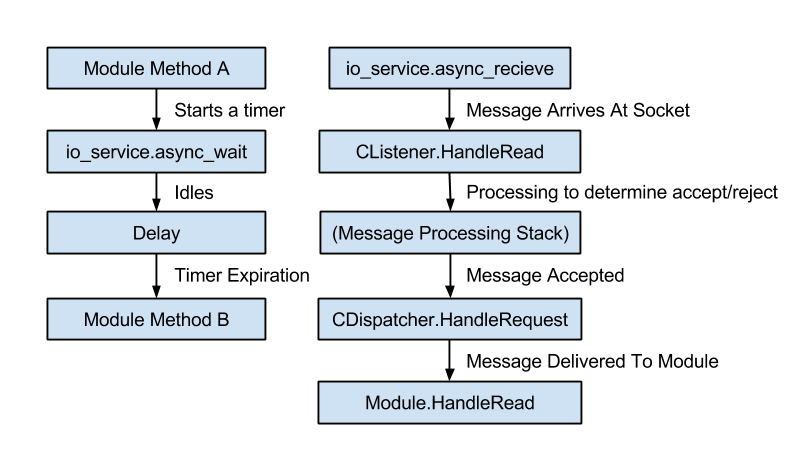
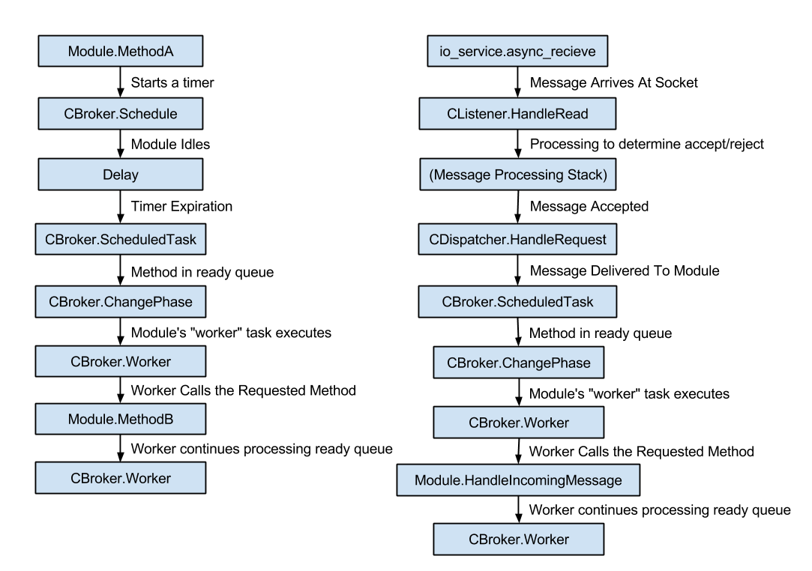
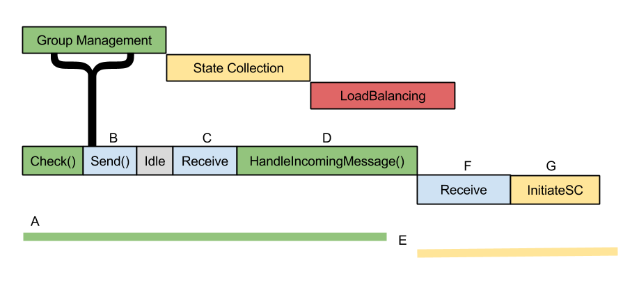

.. _cbroker:

CBroker Reference
=================

**CBroker** is a part of `CBroker.hpp`

.. doxygenclass:: freedm::broker::CBroker
    :members:

See Also
^^^^^^^^

It may be useful to start with :ref:`scheduling`.

The Scheduler
^^^^^^^^^^^^^

The non-RT DGI code made heavy use of the boost provided io_service.
This library allows for easy asynchronous calls to methods and very easy socket handling.
Tasks are inserted into the io_services run list and executed in FIFO order.
The RT scheduler takes advantage of the io_service, while trying to apply constraints on the ordering of execution.

Review: Non-RT Processing
-------------------------

To review, the modules and message processing (which are the two major components of the system) relied on a structure very similar to this:

* **Sleeps and Thread Relinquishment** - Since most of the processing for the FREEDM system currently runs on the single io_service thread used by the broker, multi-threading is emulated through the use of the io_service's async wait routines which allow a module to sleep while other modules (or the broker itself) continues doing processing on a single thread. When a task requires a break for I/O or other similar services, it will call async_wait and wait for the io_service to execute the callback it requests. There are many examples of this in the codebase.
* **Message Processing** - When a message is received for processing, it will be taken into the CListener module where it is processed to determine if it should be accepted or rejected. If accepted, it is passed to the dispatcher which examines the contents to determine which modules if any should be given the message. The module responsible for receiving the message is immediately called and allowed to act on the message. 

Real-time Processing
--------------------

To create a real-time scheduler, I've added a layer between the modules and the io_service in the broker. This layer defers the expired async_waits until it is a modules "phase." To do this, the broker now distributes timers (or more specifically, handles to the timers) and provides a function "Schedule" which is used instead of async_wait. The result is a scheduling system like this:

* **Sleeps and Thread Relinquishment** - The behavior remains similar to how it did before, except the async_wait call is replaced by a schedule call. When the timer expires, it calls the ScheduledTask method, rather than directly calling the scheduled task. This method enters the readied task into a per-module "ready queue." Once the scheduler enters that modules phase (or it is already in it) a worker method will process the ready queue in FIFO order, calling the scheduled methods.
* **Message Processing** - This also remains similar, except now instead of the dispatcher directly calling the module who should receive the incoming message the call to the module is placed in that module's ready queue. Then, as before, when the scheduler enters that module's phase, a worker method handles the actual call to the receive method.

Phase Behavior
--------------

Phases proceed in a round robin fashion. However, there are some observations to make a for this implementation. Consider the diagram above.

* **A** The group management phase begins. It spends some time authoring messages for the check function, requests them to be sent and then idles. Send, which is handled by the broker operates outside of the module scheduler and begins work immediately.
* **B** Since group management has no work to do while waiting for replies, the system is idle.
* **C** Message(s) arrive. Since one of them is addressed to group management and it is currently GroupManagement's phase, the worker immediately fulfills the request.
* **D** Processing the message makes GroupManagement over-run its phase.
* **E** There is a "No-man's" land where the group management task is completing work outside of its phase, but the scheduler is ready to switch phases to state collection. Because phases are aligned in order to form groups, state collection is penalized for by the overflow.
* **F** The scheduler has changed phases, but the broker does work on a received message before calling state collection's readied method. Note that the message is put into the ready queue for its intended process, so the message processing time is only spent by the Broker and communication stack
* **G** Finally, the state collection module begins.

